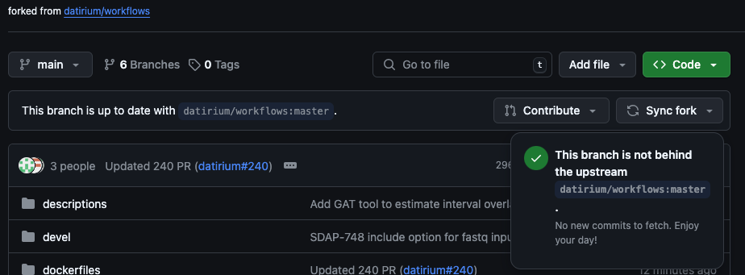
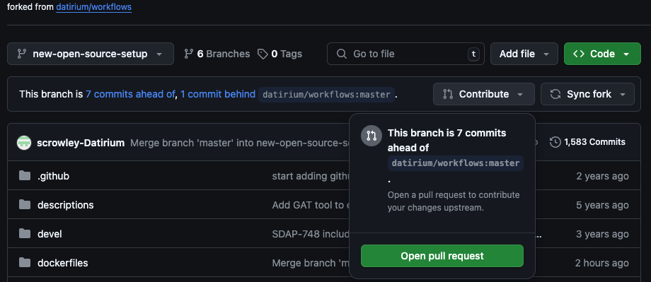

# Contributing to Workflows


## PreRequisites
- have a [github](https://github.com/signup) account
- [fork datirium workflows](https://github.com/datirium/workflows/fork)
- clone your fork: ```git clone git@github:<USERNAME>/<REPO_NAME>.git```


## Contributing Steps

1. make sure fork is up to date

2. pull locally: 
```
git checkout master
git pull origin master
```
3. create new local branch  
```git checkout -b branch_name```
4. do local development
5. add/commit changes:  
```
git add .
git commit -m "some commit message"
```
6. push to forked repo: ```git push origin <BRANCH_NAME>```
7. create PR 
from link in CLI: ```https://github.com/<USERNAME>/<REPO_NAME>/pull/new/<BRANCH_NAME>```  
or from github UI:

