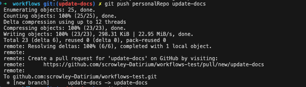
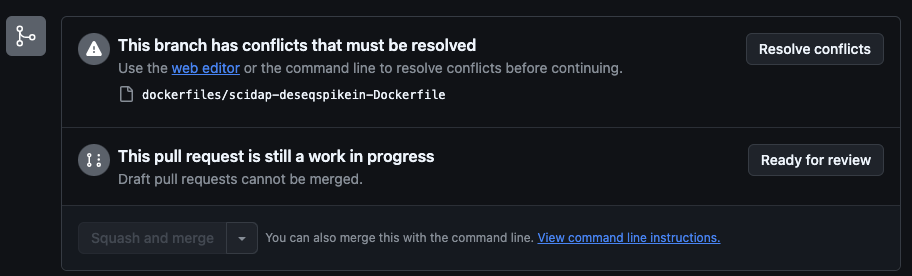
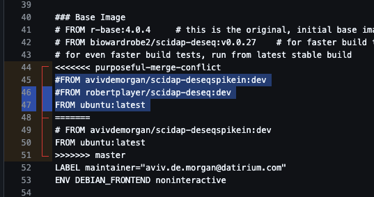

# Contributing to Workflows


## PreRequisites
- have a [github](https://github.com/signup) account
- [fork datirium workflows](https://github.com/datirium/workflows/fork)
- clone your fork: ```git clone git@github:<USERNAME>/<REPO_NAME>.git```


## Contributing Steps

1. make sure fork is up to date

2. pull locally: 
```
git checkout master
git pull origin master
```
3. create new local branch  
```git checkout -b branch_name```
4. do local development
5. add/commit changes:  
```
git add .
git commit -m "some commit message"
```
6. push to forked repo: ```git push origin <BRANCH_NAME>```
7. create PR 
from link in CLI: ```https://github.com/<USERNAME>/<REPO_NAME>/pull/new/<BRANCH_NAME>```  
  
or from github UI:

8. check for merge conflicts
  
9. resolve merge conflicts   (if needed)
- in UI:  
    1. click "resolve conflicts"
    2. find conflicts in each file and chose if incoming or original content should be kept
      
    the highlighted section is the "incoming" changes that your PR wants to make.  
    The section under the ```======``` is the content that already exists
    3. delete one of the sections, as well as the lines including ```<<<<<<``` and ```>>>>>>```
- in CLI: 
    1. sync the forks master branch with datiriums master branch (step 1 above)
    2. pull locally (step 2 above)
    3. merge into current branch: 
    ```
    git checkout branch_name
    git merge master
    ```
    4. resolve conflicts in vscode editor (find files with conflicts by running ```git status```)
    5. add commit and push changes
    6. verify conflicts are gone
