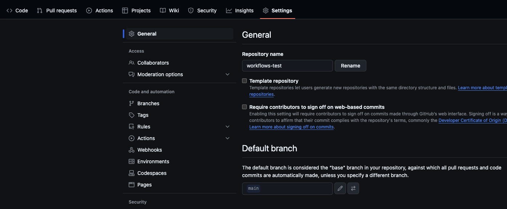

# Setup for Push based developer flow

Optimal use for push-based flow will have you setup 1 **local** repo, which has a link to 3 **remote** repo's.

The purpose of this is so that your local repo will use **branches** for differentiating; local-dev, custom-pushes, and making PRs.

Your local repo will have 2 core branches.
- the "master" branch will be kept up to date with datiriums global workflows, and will be used as the base for creating branches and resetting the "custom" repo
  > commits should NOT be made directly to the "master" branch
- the "main" branch will be how updates to "custom" workflows are made
  > commits to the "main" branch will come in the form of local **merges**

All other branches are for making PR's from the forked repo to datiriums repo 

#### Setup Steps:

1. clone datirium workflows locally  
```git clone git@github.com:datirium/workflows.git```
2. fork datirium workflows into your own repo (this is for PR's only)
> it would be good to name this forked repo something like "workflows_fork" or "workflows_pr_repo"
3. add remote reference of this forked repo to your **local** repo
```git remote add PR_REPO git@github.com:<USERNAME>/<REPO_NAME>.git```
> NOTE: the name of the remote repo here ("PR_REPO") is what you use for pushing local branches to that specific repo (so you can make a PR from that branch)  
> example: ```git push PR_REPO some_branch_name ```
4. Create a new repo in your github account (to be your "custom" repo)
> would be good to name it something like "workflows_custom"
5. Create a "main" branch from the "master" branch
```git checkout -b main```
6. Add remote reference to the (not forked) remote repo to your local repo
```git remote add CUSTOM_REPO git@github.com:<USERNAME>/<REPO_NAME>.git```
7. push "main" branch to custom repo, and set that branch as the repo's default
```git push CUSTOM_REPO main```



At this point, the output of ```git remote -v``` should be:
```
origin  git@github.com:datirium/workflows.git (fetch)
origin  git@github.com:datirium/workflows.git (push)
CUSTOM_REPO      git@github.com:<USERNAME>/<CUSTOM_NAME>.git (fetch)
CUSTOM_REPO      git@github.com:<USERNAME>/<CUSTOM_NAME>.git (push)
PR_REPO    git@github.com:<USERNAME>/<FORK_NAME>.git (fetch)
PR_REPO    git@github.com:<USERNAME>/<FORK_NAME>.git (push)
```
Now you are ready to follow the [push-based developer flow](./push_based_dev_flow.md)